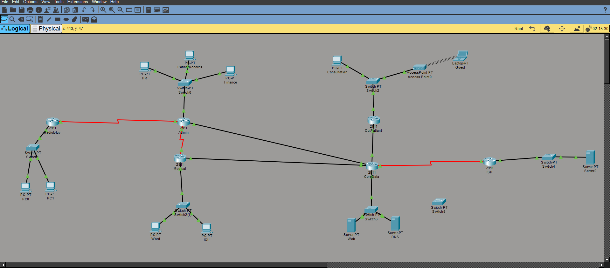
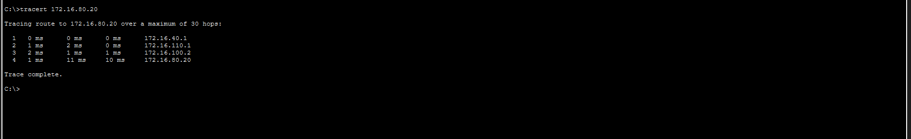
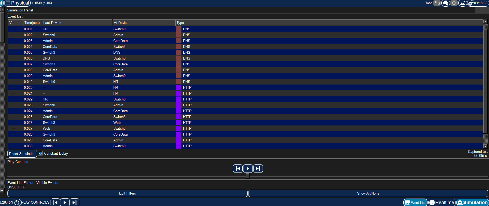

# 🏥 City Smart Hospital Network Design

<div align="center">

## Enterprise Network Architecture • Cisco Packet Tracer • OSPF • VLANs • NAT • Network Redundancy


**A complete enterprise hospital network infrastructure designed, configured, and verified using Cisco Packet Tracer.**

</div>


---

# 📖 Project Overview

The **City Smart Hospital Network Design** project presents a complete enterprise-level network architecture for a modern hospital environment.

The objective was to design a secure, scalable, and redundant network infrastructure connecting different hospital departments while ensuring reliable communication, internet access, and service availability.

The network integrates:

- Department-based VLAN segmentation
- Inter-VLAN routing
- Dynamic routing using OSPF
- DHCP services
- DNS and Web servers
- Wireless guest access
- NAT-based internet connectivity
- Network redundancy and automatic failover


This project demonstrates practical implementation of enterprise networking concepts using Cisco Packet Tracer.

---

# 🏗 Network Architecture


<p align="center">
  
</p>


The hospital network is divided into four main operational zones connected through a centralized data core:


```
                         Internet
                            |
                            |
                       ISP Router
                            |
                            |
                    Core_Data Router
                            |
        ------------------------------------------------
        |                     |                        |
        |                     |                        |
   Admin Zone           Medical Zone          Outpatient Zone
        |                     |                        |
   VLAN 10-30          VLAN 40-50             VLAN 60-70
        |
        |
                  Data Center Zone
                       VLAN 80

```


The design includes:

- Four internal hospital routers
- One external ISP router
- Multiple department VLANs
- Centralized server infrastructure
- Backup routing path for fault tolerance


---

# ✨ Key Features


## 🔹 VLAN-Based Network Segmentation

Each hospital department is isolated into a separate VLAN to reduce broadcast traffic and improve security.


Implemented VLANs:


| VLAN | Department | Network |
|------|------------|---------|
| VLAN 10 | Patient Records | 172.16.10.0/24 |
| VLAN 20 | Finance | 172.16.20.0/24 |
| VLAN 30 | HR | 172.16.30.0/24 |
| VLAN 40 | General Ward | 172.16.40.0/24 |
| VLAN 50 | ICU | 172.16.50.0/24 |
| VLAN 60 | Consultation Rooms | 172.16.60.0/24 |
| VLAN 70 | Guest Wi-Fi | 172.16.70.0/24 |
| VLAN 80 | Data Center | 172.16.80.0/24 |
| VLAN 90 | Remote Radiology Clinic | 172.16.90.0/24 |


---

# 🌐 Routing Design


## OSPF Dynamic Routing

Single Area OSPF (Area 0) was implemented between internal hospital routers.

Benefits:

- Automatic route discovery
- Dynamic topology updates
- Faster convergence
- Scalable enterprise routing


Routing topology:


```
                 Core_Data_R
                 /    |     \
                /     |      \
               /      |       \
        Admin_R   Medical_R  Outpatient_R
            |
            |
       Backup Serial Link
            |
            |
        Medical_R

```


---

# 🔄 Network Redundancy & Failover


To improve network availability, a backup serial connection was implemented:


```
Medical_R  <==============>  Admin_R

```


## Normal Operation

Traffic follows the high-speed primary path:


```
Medical_R
     |
     |
Core_Data_R

```


## After Primary Link Failure


When the main Medical_R ↔ Core_Data_R link is disconnected, OSPF automatically recalculates the shortest path:


```
Medical_R
     |
     |
Admin_R
     |
     |
Core_Data_R

```


The network continues operating without manual intervention.

<p align="center">
  
</p>


---

# 🧩 IP Addressing Scheme


The hospital was assigned the private address block:


```
172.16.0.0/16
```


Fixed Length Subnet Masking (FLSM) was applied using:


```
/24 subnet mask
```


Example:


```
VLAN 50 (ICU)

Network:
172.16.50.0/24

Gateway:
172.16.50.1

```


The third octet corresponds to the VLAN ID, creating an organized and easy-to-manage addressing structure.


---

# 🖥 Network Services


## DHCP Configuration

Each internal router operates as a DHCP server for its connected VLANs.

DHCP provides:

- Automatic IP assignment
- Default gateway configuration
- DNS server information


---

## Data Center Services


The hospital data center contains:


### DNS Server

```
IP Address:
172.16.80.20

```


Provides name resolution for:


```
www.cityhospital.local

```


### Hospital Web Server


```
IP Address:
172.16.80.10

```


Hosts the internal hospital website.


---

# 🌍 Internet Connectivity


Internet connectivity was implemented using:


## NAT Overload (PAT)


Internal hospital addresses:


```
172.16.0.0/16

```


are translated into the public ISP address:


```
203.0.113.1

```


This allows internal users to access external services while maintaining private addressing.


---

# 📡 Wireless Network Design


The Outpatient Clinic contains a dedicated wireless guest network.


Configuration:


```
Guest Wi-Fi

VLAN:
70

Network:
172.16.70.0/24

Technology:
802.11 Wireless

```


The wireless network is isolated from the wired consultation network:


```
Consultation Rooms

VLAN 60


Guest Wi-Fi

VLAN 70

```


This improves security and prevents unauthorized access to hospital resources.


---

# 🔍 Traffic Analysis


Cisco Packet Tracer Simulation Mode was used to analyze communication between an internal PC and the hospital web server.


Captured protocols:


## DNS Request


```
Protocol:
UDP

Port:
53

Purpose:
Domain name resolution

```


DNS uses UDP because:

- It has low overhead
- It provides fast request-response communication
- No connection establishment is required


---


## HTTP Request


```
Protocol:
TCP

Port:
80

Purpose:
Reliable web communication

```


HTTP uses TCP because:

- Data delivery must be reliable
- Packets must arrive in order
- Lost data must be retransmitted


<p align="center">
  
</p>


---

# 🛠 Technologies Used


| Category | Technologies |
|----------|--------------|
| Network Simulation | Cisco Packet Tracer |
| Routing | OSPF Area 0 |
| Switching | VLANs, 802.1Q Trunking |
| Addressing | FLSM Subnetting |
| Services | DHCP, DNS, HTTP |
| Internet Access | NAT/PAT |
| Wireless | IEEE 802.11 |
| Testing | Ping, Traceroute, Simulation Mode |
| Documentation | LaTeX Report |


---

# 📂 Repository Structure


```
City-Smart-Hospital-Network
│
├── PacketTracer
│   └── Hospital_Network.pkt
│
├── Report
│   └── Project_Report.pdf
│
├── images
│   ├── Network_Architecture.png
│   ├── PacketTracer_Topology.png
│   ├── Failover_Test.png
│   └── Traffic_Analysis.png
│
└── README.md

```


---

# 📸 Project Gallery


## Network Architecture


<p align="center">
  
</p>


## Network Failover Testing


<p align="center">
  
</p>


## Traffic Analysis


<p align="center">
  
</p>


---

# 📄 Documentation


The complete technical report is available here:


```
Report/Project_Report.pdf

```


The report includes:

- Complete IP addressing scheme
- VLAN configuration
- Router configurations
- OSPF implementation
- NAT configuration
- Connectivity verification
- Failover analysis
- Protocol analysis


---

# 👨‍💻 Team


Developed as part of:


**CIE 447 / CIE 367 — Computer Networks Project**

Department of Computer and Information Engineering

University of Science and Technology in Zewail City

Spring 2026


---

# 🚀 Skills Demonstrated


✅ Enterprise Network Design

✅ Cisco Router Configuration

✅ Cisco Switching

✅ VLAN Segmentation

✅ Router-on-a-Stick Configuration

✅ DHCP Deployment

✅ OSPF Dynamic Routing

✅ NAT/PAT Configuration

✅ Network Redundancy

✅ Traffic Analysis


---


